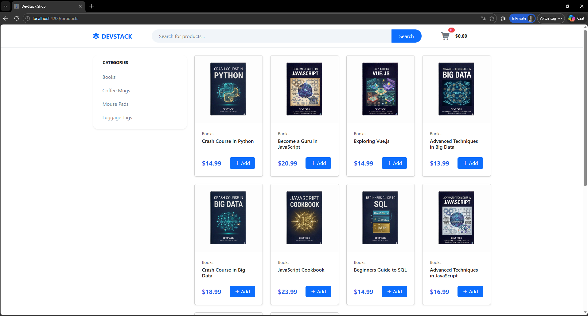
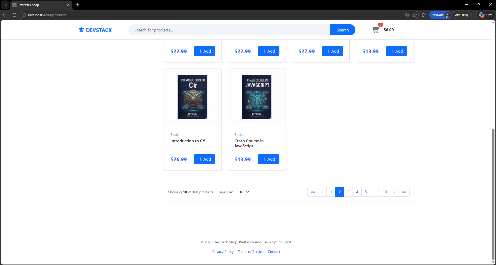
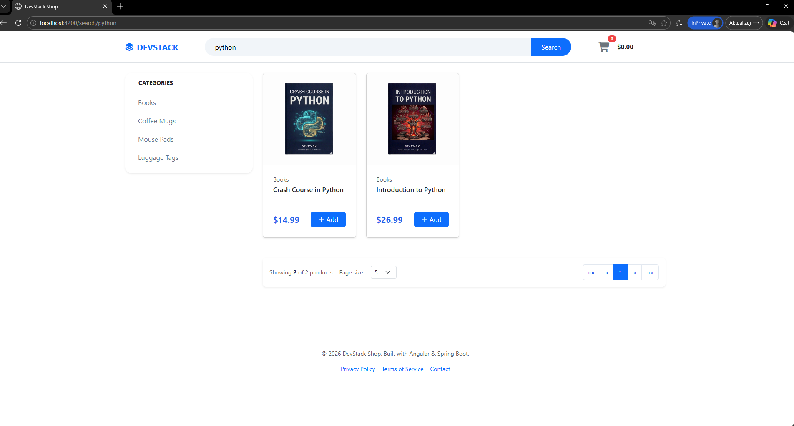
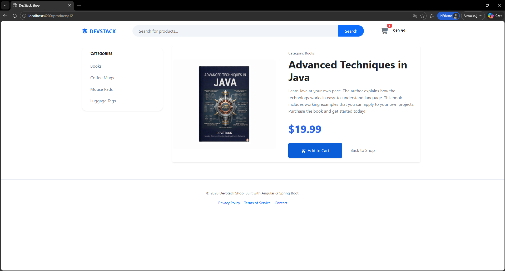
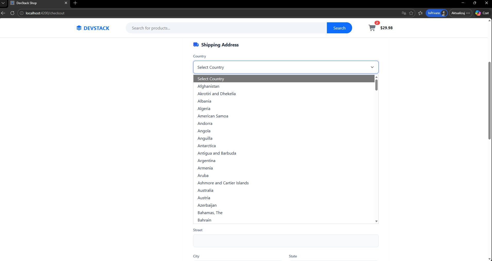
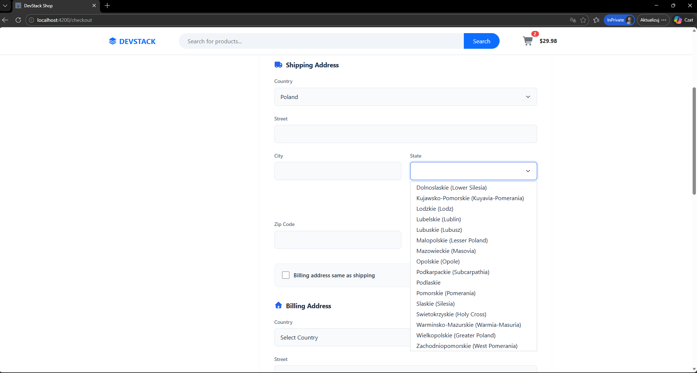
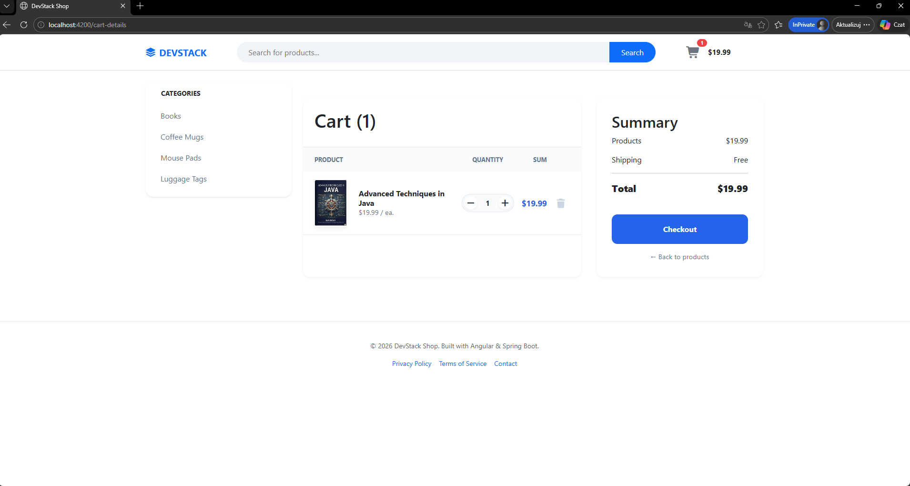
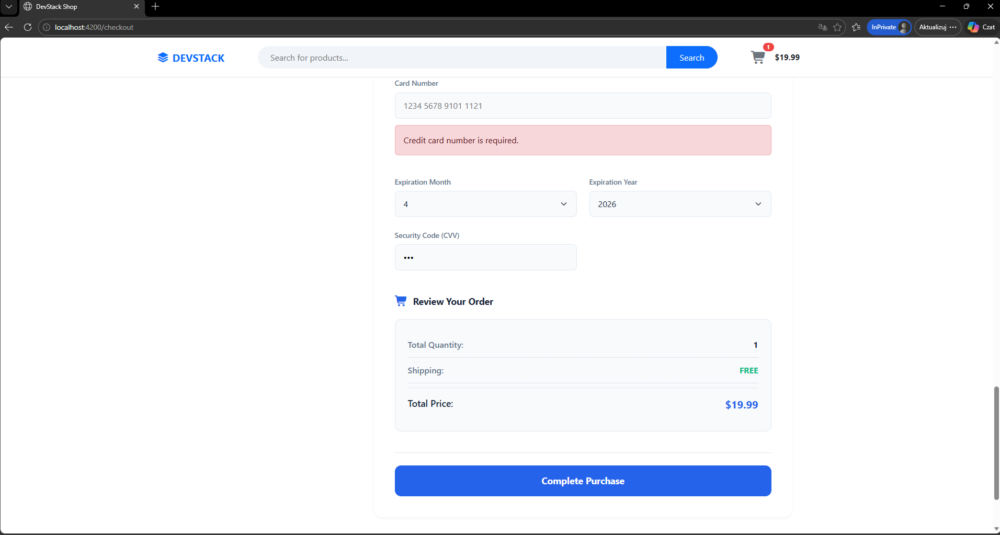
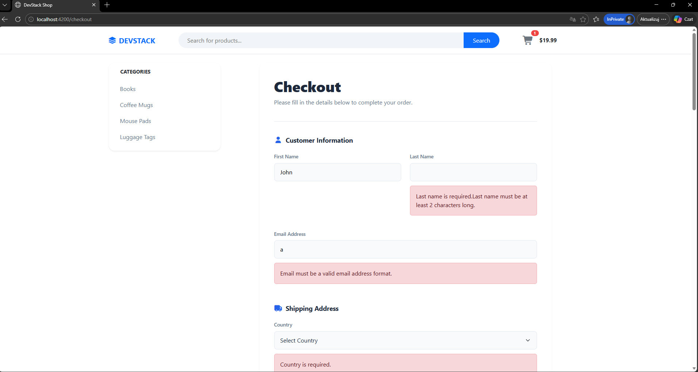

# 🛒 DevStack Shop - Full Stack E-commerce Platform

A modern, high-performance e-commerce application built with **Java 21**, **Spring Boot 4**, and **Angular 21**. This project serves as a technical showcase of modern reactive programming, high-performance backend architecture, and robust frontend state management.

## 🔗 Project Components
* **Backend API (this repo):** Java 21, Spring Boot 4
* **Frontend UI Repository:** Angular 21.2.0 | (https://github.com/MarcinRejniak/e-commerce-angular)

## 📸 App Preview

A visual walkthrough of the core features and user experience of the DevStack Shop platform.

### 📦 Dynamic Product Catalog
The application leverages high-performance **server-side pagination (Spring Boot 4)** to ensure seamless browsing of thousands of products with minimal network overhead and optimized database queries.

| First 10 products | Second page of products |
|---|---|
|  |  |

---

### 🔍 Smart Search & Filtering
Fast and efficient keyword-based discovery. The backend is optimized to handle dynamic search queries, allowing users to find specific technologies or topics (e.g., "Python") instantly.

*Keyword-based product filtering with real-time UI updates.*

---

### 📖 Product Deep-Dive
Each product features a dedicated detail page where data is fetched asynchronously using **Angular 21's modern routing**, providing an instantaneous and responsive user experience.

*Detail view with dynamic data fetching and clean UI architecture.*

---

### 🌍 Dynamic Geographic Data Integration
A core technical highlight: The application reactively fetches and synchronizes country and state data from external APIs.
* **Reactive Sync:** Selecting a country automatically triggers a filtered fetch for corresponding states.
* **Defensive Mapping:** The **Java 25** backend ensures stability by handling polymorphic responses from third-party geographic services.

| Country Selection | Dynamic State Loading |
|---|---|
|  |  |

---

### 🛒 Reactive Shopping Experience (Signals-Driven)
Cart management is powered entirely by **Angular Signals**, eliminating the need for manual change detection or heavy RxJS subscriptions. This ensures 100% data consistency across the UI in real-time.

| Cart Details | Cart Summary |
|---|---|
|  |  |

---

### 🛡️ Defensive Validation & UX
The checkout flow features an advanced, multi-layered validation system. It provides immediate visual feedback to the user, ensuring data integrity before any request hits the backend.

*Real-time error handling and feedback powered by custom DevStackValidators.*

## 🌟 Key Features

* **Dynamic Geographic Data:** Full integration with external REST APIs (Altoal) to fetch countries and states dynamically.
* **Advanced Checkout System:** * Address synchronization (Shipping to Billing) with Signal-based state management.
    * Real-time validation and error handling.
* **Reactive State Management:** Utilizing **Angular Signals** for the shopping cart and UI state, replacing traditional RxJS Subjects for better performance and readability.
* **Robust Backend:** * RESTful API with Spring Boot.
    * Data persistence using Spring Data JPA & Hibernate.
    * Pagination, filtering, and searching capabilities.
* **Custom Validation:** Implemented proprietary validators (e.g., `notOnlyWhitespace`) to ensure high-quality user data.

## 🛠 Tech Stack

### Backend
- **Core:** Java 21+, Spring Boot 4.0.3
- **Data:** Spring Data JPA, Hibernate, MySQL
- **Security/Tools:** Lombok, Maven, Jackson

### Frontend
- **Core:** Angular 21.2.0, TypeScript
- **State:** Angular Signals (Modern reactive approach)
- **Styling:** CSS3 (Custom Variables), Bootstrap 5, FontAwesome

## 🚀 Technical Highlights

### Defensive API Mapping (Java)
One of the core challenges was handling inconsistent data formats from external geographic APIs. I implemented a **Defensive Mapping Layer** using Java Streams and polymorphic type checking (handling both `String` and `Map` JSON structures) to ensure backend stability regardless of external API changes.

### Reactive UI with Signals
The application utilizes the latest Angular features. The shopping cart and address synchronization logic leverage **Signals** and **Computed values**, reducing boilerplate code and optimizing change detection cycles.